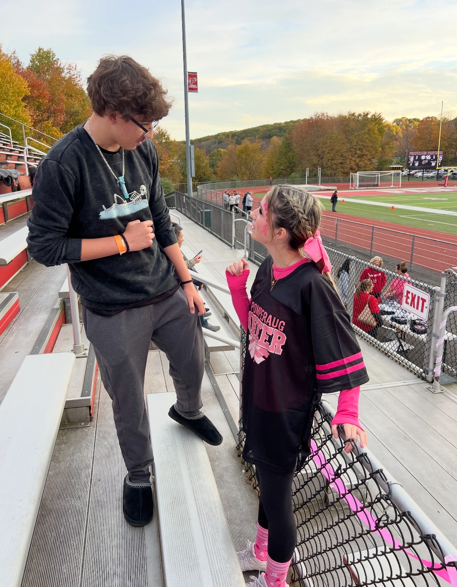
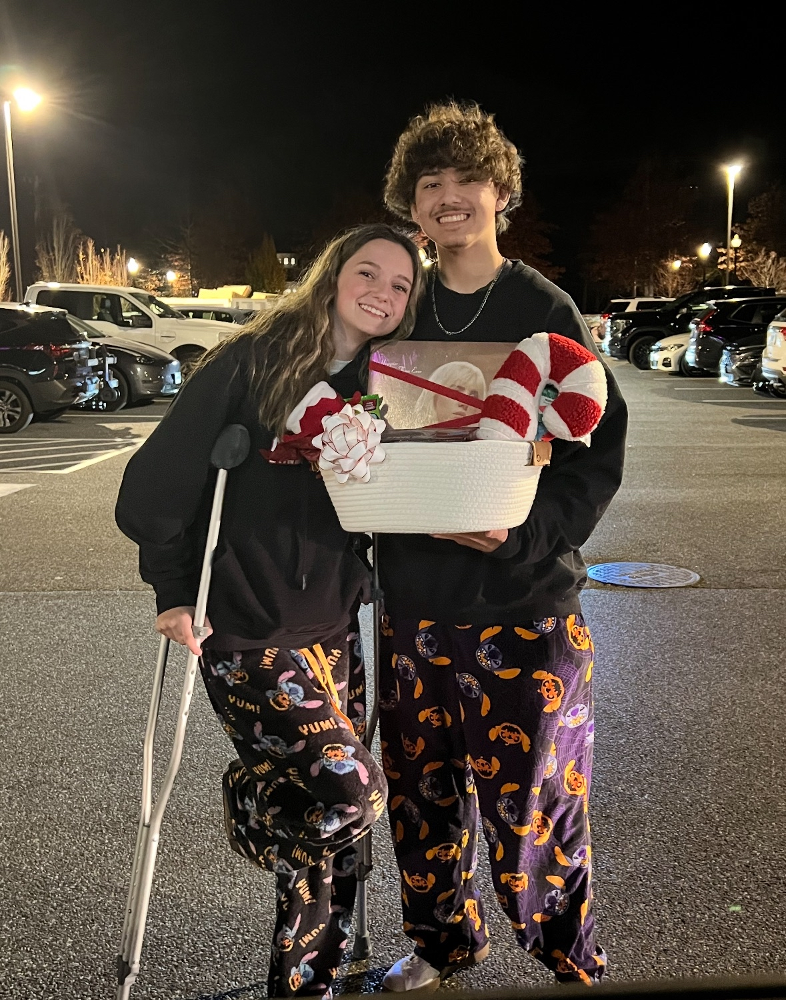
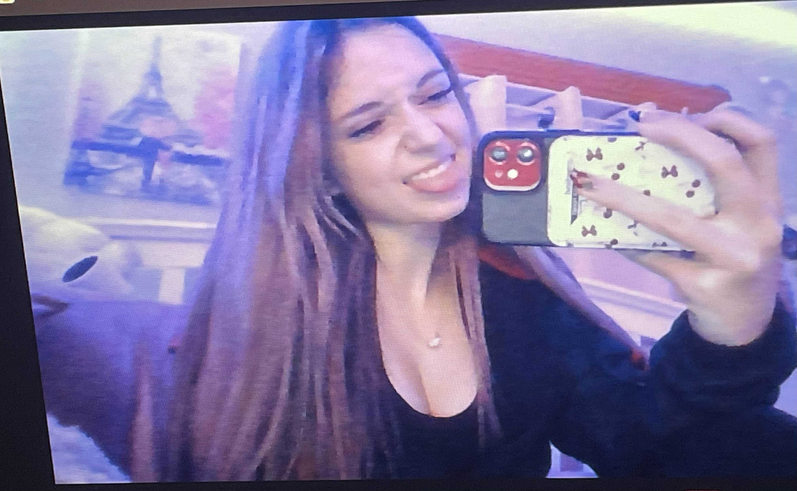
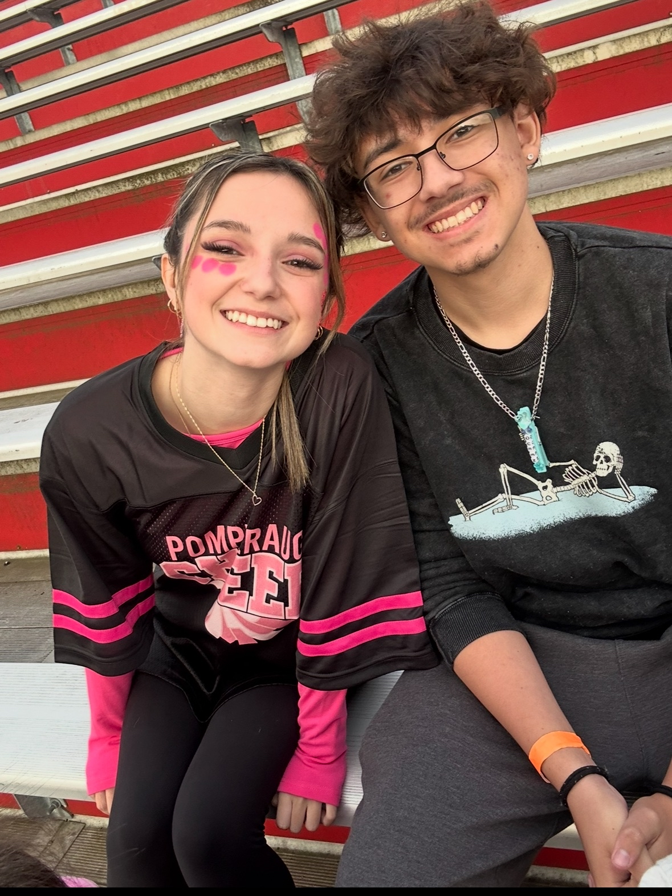
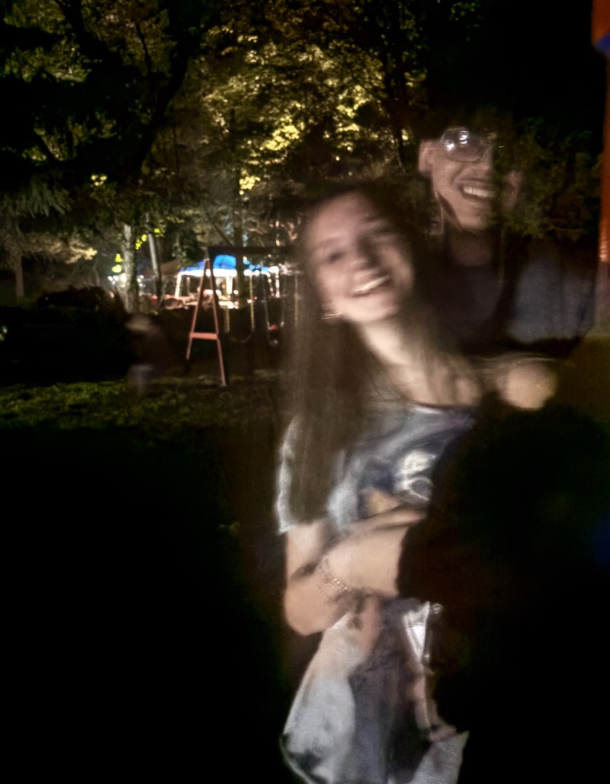
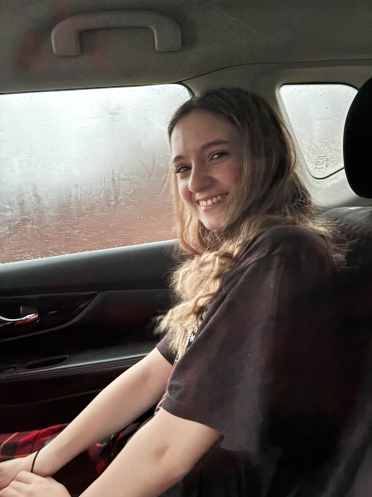
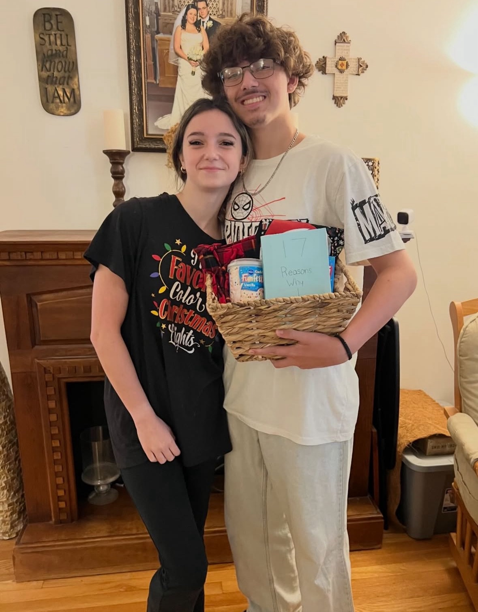
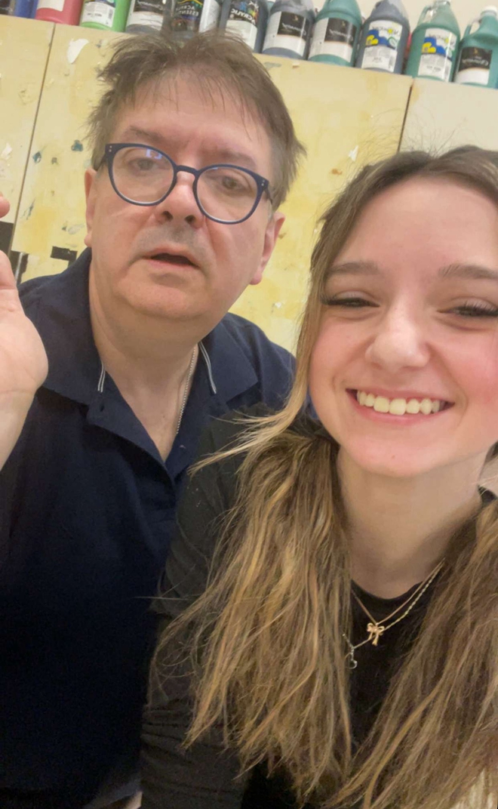
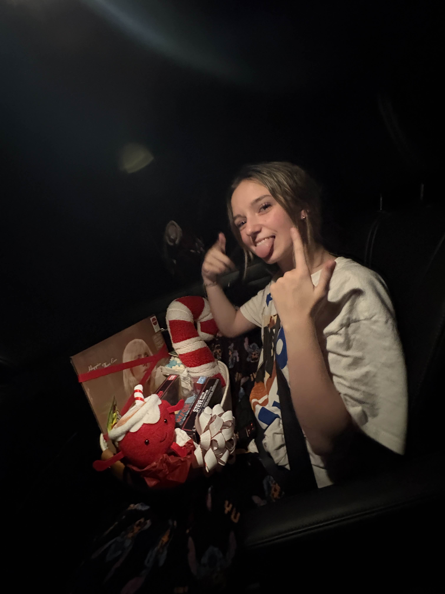
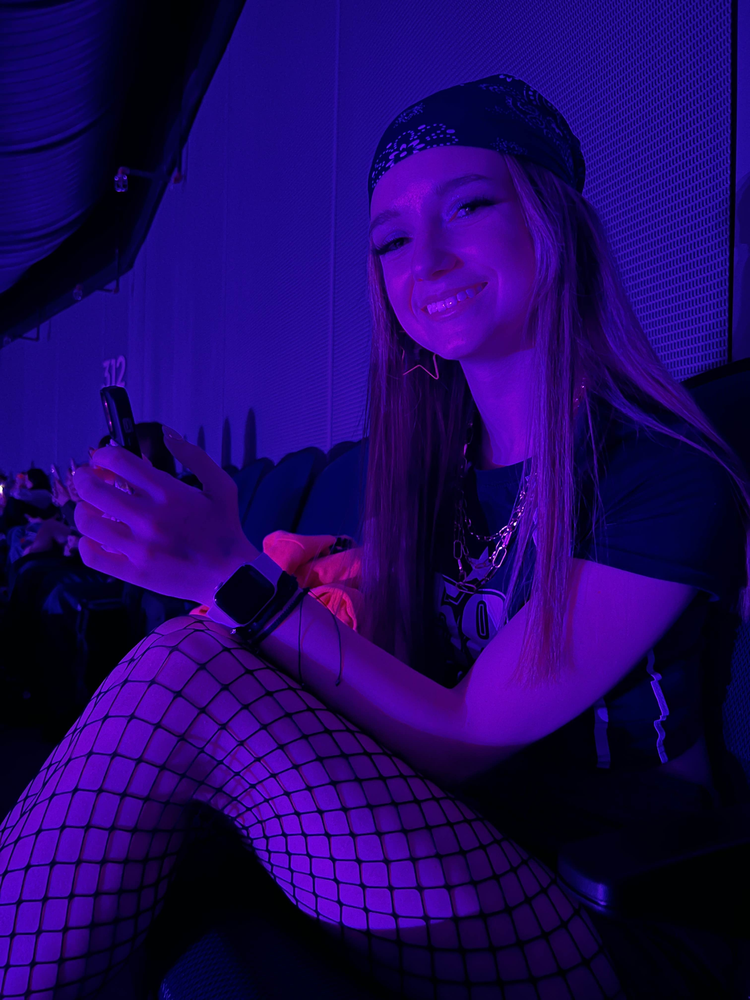

<!DOCTYPE html>
<html lang="en">
<head>
    <meta charset="UTF-8">
    <meta name="viewport" content="width=device-width, initial-scale=1.0">
    <title>Six Months & Forever</title>
    <!-- Load Tailwind CSS -->
    <!-- Use Inter and Playfair Display fonts --><link href="https://fonts.googleapis.com/css2?family=Inter:wght@100..900&family=Playfair+Display:ital,wght@0,400..900;1,400..900&display=swap" rel="stylesheet">
    
</head>
<body>
    
    <!-- Floating Images for Ambiance -->
    
    
    
    

    <!-- Header (Sticky and Dark/Slightly Transparent) -->
    <header class="sticky top-0 z-50 p-4 bg-slate-900/90 backdrop-blur-sm shadow-xl shadow-fuchsia-900/50">
        

            <h1 class="text-xl md:text-2xl font-extrabold text-fuchsia-300 tracking-widest transition duration-500">SIX MONTHS OF US</h1>
        

    </header>

    <!-- MAIN CONTENT COLUMN (Center aligned on dark background) -->
    

        
        

            <main class="max-w-4xl mx-auto py-12 md:py-20 space-y-16 md:space-y-24 px-6 md:px-12">

                <!-- 1. Hero Section -->
                <section class="text-center reveal p-4 md:p-8">
                    <!-- Date updated to Dec. 7th, 2025 -->
                    
Dec. 7th, 2025

                    <h2 class="text-6xl md:text-8xl font-black hero-title leading-none md:leading-tight">
                        Our Story So Far...
                    </h2>
                    

                        Six months ago was just the start of our official journey, but my heart has been yours for three years now. This is a tribute to the most beautiful, brilliant, and kind person I know.
                    

                    <svg class="mx-auto mt-12 animate-bounce text-fuchsia-600" xmlns="http://www.w3.org/2000/svg" width="40" height="40" viewBox="0 0 24 24" fill="none" stroke="currentColor" stroke-width="2" stroke-linecap="round" stroke-linejoin="round"><path d="M12 5v14M19 12l-7 7-7-7"/></svg>
                </section>
                
                <!-- 2. Live Counter Section -->
                <section class="text-center reveal max-w-2xl mx-auto">
                    

                        <h2 id="counter-title" class="text-2xl md:text-3xl font-bold mb-6 font-serif text-fuchsia-200">
                            Counting Down To Forever...
                        </h2>
                        

                            

                                
00

                                
Days

                            

                            

                                
00

                                
Hours

                            

                            

                                
00

                                
Minutes

                            

                            

                                
00

                                
Seconds

                            

                        

                    

                </section>

                <!-- 3. Our Song / Playlist Section -->
                <section class="reveal border-b border-t border-fuchsia-100 py-10 md:py-14 max-w-3xl mx-auto text-center">
                    <h3 class="text-3xl md:text-4xl font-bold mb-6">Our Song: "we fell in love in october"</h3>
                    

                        This song captures the hidden feeling I had for you since the beginning. The moment I realized I was secretly falling for my best friend's amazing cousin.
                    

                    <a href="https://open.spotify.com/album/7vud0sY43VTv28MbWiglDa" target="_blank" class="inline-flex items-center justify-center px-8 py-3 border border-transparent text-base font-medium rounded-full text-white bg-fuchsia-600 hover:bg-fuchsia-700 md:py-4 md:text-lg md:px-10 shadow-lg transition duration-300 transform hover:scale-105">
                        <svg class="w-6 h-6 mr-3" xmlns="http://www.w3.org/2000/svg" viewBox="0 0 24 24" fill="currentColor"><path d="M12 2C6.48 2 2 6.48 2 12s4.48 10 10 10 10-4.48 10-10S17.52 2 12 2zm3.32 15.65a.49.49 0 01-.6-.18c-.97-1.18-2.45-1.55-4.22-1.28-1.56.24-2.86.84-3.56 1.48a.49.49 0 01-.63-.23.5.5 0 01.19-.66c.8-.73 2.25-1.35 3.96-1.61 2.1-.31 3.8-.1 5.06 1.48a.5.5 0 01-.19.66zM15.4 14.5a.49.49 0 01-.6-.22c-.9-1.2-2.3-1.65-4.04-1.39-1.5.22-2.73.78-3.39 1.37a.49.49 0 01-.63-.25.5.5 0 01.21-.65c.7-.6 2.05-1.2 3.78-1.44 2.1-.3 3.8-.08 5.05 1.54a.5.5 0 01-.21.64zM16.14 13.43a.5.5 0 01-.61-.25c-.75-1.1-1.9-1.65-3.4-1.89-1.5-.24-2.8.2-3.5.83a.5.5 0 01-.61-.25.5.5 0 01.25-.6c.8-.75 2.1-1.2 3.6-1.39 1.6-.19 3 .2 4.1 1.7a.5.5 0 01-.25.65z"/></svg>
                        Listen to The Song
                    </a>
                </section>
                
                <!-- 4. Memory Gallery -->
                <section class="space-y-16">
                    <h2 class="text-center text-5xl font-black text-rose-500 font-serif reveal">Our Shared Memories</h2>

                    <!-- Memory: The Scold (Image 1.png) -->
                    

                        

                            <h3 class="text-3xl font-bold">The Scold (My Favorite View)</h3>
                            

                                You pretend to scold me, but since you're so much shorter, you have to look all the way up. It's the cutest thing in the world, and honestly, I wouldn't trade that view for anything.
                            

                            

                                A snapshot of your fierce, adorable side.
                            

                        

                        

                            <!-- Image 1.png -->
                            
                        

                    

                    <!-- Memory: Matching PJs & Gifts (Image 2.png) -->
                    

                        

                            <!-- Image 2.png -->
                            
                        

                        

                            <h3 class="text-3xl font-bold">Matching PJs & Gifts</h3>
                            

                                Remember giving you that gift and us immediately taking a picture in our ridiculously comfortable, matching PJs? It’s a perfect snapshot of our happy, cozy life together.
                            

                            

                                A picture that captures your amazing spirit.
                            

                        

                    

                    <!-- Memory: Your Always Perfect Smile (Image 3.png) -->
                    

                        

                            <h3 class="text-3xl font-bold">Your Always Perfect Smile</h3>
                            

                                This picture captures that beautiful, bright, infectious smile of yours perfectly. It’s the energy and light you bring into my life every single day.
                            

                            

                                A beautiful memory of one of our best days.
                            

                        

                        

                            <!-- Image 3.png -->
                            
                        

                    

                    
                    <!-- Memory: Cheer Captain Stunner (Image 4.png) -->
                    

                        

                            <!-- Image 4.png -->
                            
                        

                        

                            <h3 class="text-3xl font-bold">Cheer Captain Stunner (My Favorite)</h3>
                            

                                This is my favorite photo of us because we both just look amazing, especially you in your cheer captain uniform. You truly own every room you walk into.
                            

                            

                                A moment of deep connection.
                            

                        

                    

                    <!-- Memory: 4th of July (on the 5th!) (Image 5.png) -->
                    

                        

                            <h3 class="text-3xl font-bold">4th of July (on the 5th!)</h3>
                            

                                Your favorite pic from that 4th of July party, even though we ended up taking it on the 5th. It was a chaotic, beautiful weekend, just like our lives—in the best way.
                            

                            

                                A photo from our best date.
                            

                        

                        

                            <!-- Image 5.png -->
                            
                        

                    

                    <!-- Memory: The "Steamy Movie" Afterglow (Image 6.png) -->
                    

                        

                            <!-- Image 6.png -->
                            
                        

                        

                            <h3 class="text-3xl font-bold">The "Steamy Movie" Afterglow</h3>
                            

                                Just after that... uh... "steamy movie," you were glowing and smiling like this. It's a reminder of all the good times, and how easily you make me blush.
                            

                            

                                A picture from a moment of focused thought or achievement.
                            

                        

                    

                    <!-- Memory: The Birthday PJs (Your Gift to Me) (Image 7.png) -->
                    

                        

                            <h3 class="text-3xl font-bold">The Birthday PJs (Your Gift to Me)</h3>
                            

                                This is a picture of the incredible birthday gift you gave me—a photo of us in our matching PJs. It’s the thoughtfulness behind your gifts that means the most.
                            

                            

                                A memory of us being there for each other.
                            

                        

                        

                            <!-- Image 7.png -->
                            
                        

                    

                    <!-- Memory: The Stunning Student (Image 8.png) -->
                    

                        

                            <!-- Image 8.png -->
                            
                        

                        

                            <h3 class="text-3xl font-bold">The Stunning Student</h3>
                            

                                A picture with your teacher, but seriously, you look so so pretty in this one. It perfectly captures your grace and professionalism while still showcasing your incredible beauty.
                            

                            

                                A picture of you doing what you love.
                            

                        

                    

                    <!-- Memory: Another Gorgeous Smile (Image 9.png) -->
                    

                        

                            <h3 class="text-3xl font-bold">Another Gorgeous Smile</h3>
                            

                                I can never have too many photos of you smiling. This one is another favorite—pure, happy, and just you.
                            

                            

                                A scenic or aspirational photo that feels like our future.
                            

                        

                        

                            <!-- Image 9.png -->
                            
                        

                    

                    
                    <!-- Memory: Our Sweetest Moment (Image 10.png) -->
                    

                        

                            <!-- Image 10.png -->
                            
                        

                        

                            <h3 class="text-3xl font-bold">Our Sweetest Moment</h3>
                            

                                I love this picture of us kissing. It encapsulates all the love, trust, and connection we share in a single, perfect moment.
                            

                            

                                A picture that reminds me of our shared laughter.
                            

                        

                    

                    <!-- Memory: Car Ride & Gift Excitement (Image 11.png) -->
                    

                        

                            <h3 class="text-3xl font-bold">Car Ride & Gift Excitement</h3>
                            

                                You in the car, holding your gift, and that genuine, happy smile. It reminds me how much joy I get from seeing you happy.
                            

                            

                                A cozy photo of us together at home.
                            

                        

                        

                            <!-- Image 11.png -->
                            
                        

                    

                    <!-- Memory: Billie Eilish Vibe (Image 12.png) -->
                    

                        

                            <!-- Image 12.png -->
                            
                        

                        

                            <h3 class="text-3xl font-bold">Billie Eilish Vibe</h3>
                            

                                You at the Billie Eilish concert, completely lost in the moment. Your excitement is contagious, and I love watching you enjoy the things you're passionate about.
                            

                            

                                A photo that shows your inner resolve.
                            

                        

                    

                </section>

                <!-- 5. Final Message & Signature -->
                <section class="reveal pt-16 pb-20">
                    

                        <h3 class="text-4xl md:text-5xl font-black text-rose-700 mb-6 font-serif">Happy Six Months!</h3>
                        

                            Every day with you is a gift I unwrap with joy. Thank you for being my everything. I love you more than words can say, and I can't wait to see what the rest of our lives holds.
                        

                        <!-- Name is Josiyah -->
                        

                            — Forever Yours, Josiyah
                        

                    

                </section>
            </main>
        
            <!-- Footer -->
            <footer class="text-center py-8 border-t border-fuchsia-100 bg-slate-100">
                
&copy; 2025 Our Story. All moments reserved.

            </footer>
        

    

    
</body>
</html>
